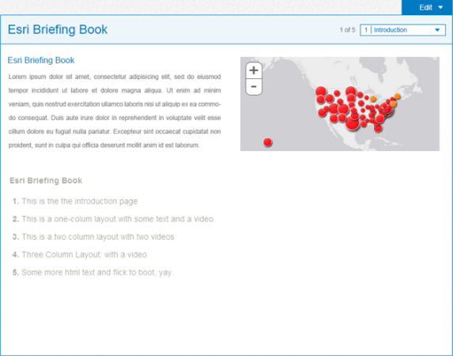

# briefing-book

Briefing Book is a configuration of ArcGIS and a JavaScript application that allows users to view and create map-based briefings and reports with interactive content.

This application can be deployed by local, state, and national governments; utilities, NGOs, as well as private industries; to create and deliver dynamic and interactive briefings and reports for executives, decision-makers, knowledge-workers, and constituents.

The Briefing Book can be used to create new briefings and reports that include ArcGIS maps, videos, photos, and written text. The briefings and reports are stored in your ArcGIS Online Organization or Portal for ArcGIS site and can be shared with members of your organization or the general public. The Briefing Book presents briefings and reports you author on a single bookshelf optimized for tablet devices.

## Features

* Create briefings and reports including ArcGIS maps, videos, photos, and written text
* Share books with the public or individuals 

## Instructions

### General Help
[New to Github? Get started here.](http://htmlpreview.github.com/?https://github.com/Esri/esri.github.com/blob/master/help/esri-getting-to-know-github.html)

## Getting Started

You'll need to configure and publish that application to get started:

[Configure the application](http://solutions.arcgis.com/local-government/help/briefing-book/get-started/configure-application/)

[Publish the application](http://solutions.arcgis.com/local-government/help/briefing-book/get-started/publish-application/)

## Resources

Learn more about Esri's [ArcGIS Solutions](http://solutions.arcgis.com/).

Show me a list of other [Esri GitHub repositories](http://esri.github.io/).

## Issues

Find a bug or want to request a new feature?  Please let us know by submitting an issue.

## Contributing

Esri welcomes contributions from anyone and everyone.
Please see our [guidelines for contributing](https://github.com/esri/contributing).

## Licensing

Copyright 2013 Esri

Licensed under the Apache License, Version 2.0 (the "License");
you may not use this file except in compliance with the License.
You may obtain a copy of the License at

   http://www.apache.org/licenses/LICENSE-2.0

Unless required by applicable law or agreed to in writing, software
distributed under the License is distributed on an "AS IS" BASIS,
WITHOUT WARRANTIES OR CONDITIONS OF ANY KIND, either express or implied.
See the License for the specific language governing permissions and
limitations under the License.

A copy of the license is available in the repository's
[LICENSE.txt](LICENSE.txt) file.

